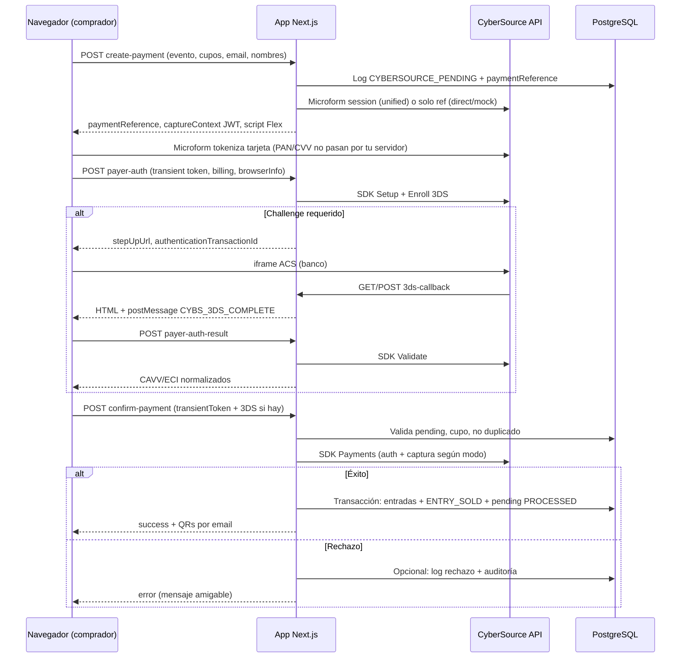

# Guía de implementación: pagos con tarjeta (CyberSource) y modelo tipo BAC

Este documento describe **cómo está implementado** en este proyecto el flujo de pago online para entradas a eventos usando **CyberSource** como pasarela técnica. En producción, el **adquirente / banco emisor** (por ejemplo el ecosistema **BAC** en Honduras) se configura **en el Business Center de CyberSource y con el banco**, no en el código de la aplicación: la app solo envía montos en **HNL**, referencias de pedido y datos de facturación/3DS que CyberSource requiere.

Para **reembolsos y anulaciones**, ver también `CYBERSOURCE-PAGOS-Y-ANULACIONES.md`.

---

## 1. Roles: qué hace cada pieza

| Pieza | Rol en este proyecto |
|--------|----------------------|
| **Tu aplicación (Next.js)** | Crea el “intento de compra”, muestra el formulario seguro (Microform), orquesta 3DS si aplica, confirma el cobro y emite entradas solo si hay autorización/captura válida y `captureId` resuelto. |
| **CyberSource** | Tokenización (Flex Microform), Payer Authentication (3DS2), autorización y captura con el procesador configurado en el merchant. |
| **BAC / adquirente** | Contrato comercial y técnico con CyberSource (MID, reglas 3DS, límites, moneda). La app no llama APIs de BAC directamente. |
| **Base de datos (Prisma)** | Guarda pedido pendiente (`CYBERSOURCE_PENDING`), venta exitosa (`ENTRY_SOLD`), auditoría y opcionalmente log de rechazos. |

---

## 2. Arquitectura del flujo (vista general)

---

## 3. Requisitos para que funcione (checklist)

### 3.1 En CyberSource (Business Center)

- Cuenta **merchant** activa en **test** (`apitest.cybersource.com`) y luego **live** (`api.cybersource.com`).
- **REST API** habilitada con:
  - **Merchant ID**
  - **Key ID** (clave de firma HTTP)
  - **Shared secret** (se usa en HMAC; en el portal suele venir en Base64).
- Configuración del **procesador / adquirente** (BAC u otro) según contrato: moneda **HNL**, reglas de captura, 3DS.
- Para **Microform v2**: permisos para crear sesiones en el recurso de microform.
- Para **Payer Authentication (3DS2)**: enrollment según redes (Visa/Mastercard/Amex); en test a veces hace falta registro de merchant en directorios de prueba (mensajes de “directory server” en logs).

### 3.2 En tu infraestructura

- **HTTPS** público en el dominio donde corre el checkout (Microform valida `targetOrigins`).
- Variables `NEXTAUTH_URL` o `NEXT_PUBLIC_APP_URL` alineadas con la **URL real** del sitio (callbacks 3DS y `returnUrl` del enroll).
- El header **`Origin`** en `create-payment` se usa para construir `targetOrigins` del JWT de Microform: debe coincidir con `window.location.origin` del cliente.
- Base de datos con migración / `db push` que incluya modelo de **Event** con precio online (`paypalPrice` en schema; nombre histórico “paypal” pero es el precio **online/CyberSource**), logs y tablas auxiliares según tu versión del repo.

### 3.3 Dependencias npm

- `cybersource-rest-client` (SDK oficial para `PaymentsApi`, `CaptureApi`, Payer Auth según uso en `lib/cybersource-sdk-direct.ts`).
- Carga del **script Flex** desde el host que indica el JWT (`testflex` / `flex` según ambiente).

---

## 4. Variables de entorno (referencia)

| Variable | Descripción |
|----------|-------------|
| `CYBERSOURCE_ENV` | `test` → `apitest.cybersource.com`. Valores tratados como **live**: `live`, `production`, `prod`, `1`, `true` → `api.cybersource.com`. |
| `CYBERSOURCE_MERCHANT_ID` | ID del comercio. |
| `CYBERSOURCE_KEY_ID` | Key ID para firma HTTP. |
| `CYBERSOURCE_SHARED_SECRET` | Secreto compartido (Base64 o texto según soporte en `lib/cybersource.ts`). |
| `CYBERSOURCE_MOCK` | `true`: no llama a CyberSource en confirm; simula éxito tras `create-payment` (útil para QA de UI). |
| `CYBERSOURCE_PAYMENT_MODE` | `unified` (default): Microform + transient token. `direct`: número de tarjeta en servidor (solo práctica típica de **sandbox**). |
| `CYBERSOURCE_ENABLE_3DS` | `true` / `false`: si `false`, `payer-auth` responde `skipped` y el pago puede ir sin datos 3DS (según riesgo/reglas del banco). |
| `NEXTAUTH_URL` o `NEXT_PUBLIC_APP_URL` | URL base de la app (sin slash final al usar en código). |
| `DATABASE_URL` | PostgreSQL para Prisma. |

No es necesario exponer secretos al cliente: solo el **capture context JWT** y la URL del script Flex son públicos por diseño.

---

## 5. Modelo de negocio en la aplicación

- **Evento** (`Event`): debe estar activo, con **`paypalPrice`** (precio unitario online en la moneda del cobro; en código el cobro usa **`HNL`** fijo en rutas CyberSource).
- **Cupo**: antes de crear el pago y antes de emitir entradas se valida capacidad (`assertEventEntryCapacity`).
- **Pedido pendiente**: no es una tabla dedicada “orders”; es un **`Log`** con `action: EVENT_UPDATED` y `details.type: CYBERSOURCE_PENDING` que guarda `paymentReference`, `eventId`, nombres, email, total, etc. `confirm-payment` **exige** encontrar este log por `paymentReference` + `eventId` (ventana de tiempo reciente, p. ej. 48 h en código actual).
- **Éxito**: creación de `Entry`, log `ENTRY_SOLD` con `source: online_cybersource`, metadatos de transacción/`captureId`, actualización del pending a `PROCESSED`, email con QR.
- **Rechazo**: respuesta HTTP de error al cliente; el proyecto puede persistir auditoría (`CYBERSOURCE_PAYMENT_AUDIT`) y/o **log de rechazos** (`OnlinePaymentRejection`) para soporte.

---

## 6. Endpoints de la API (contrato conceptual)

### 6.1 `POST /api/cybersource/create-payment`

**Entrada típica:** `eventId`, `numberOfEntries`, `clientNames[]`, `clientEmail`, `clientPhone` opcional.

**Qué hace:**

1. Valida datos, evento, precio online y cupo.
2. Genera `paymentReference` único (prefijo tipo `CS-...`).
3. Inserta log **`CYBERSOURCE_PENDING`**.
4. Según modo:
   - **Mock** (`CYBERSOURCE_MOCK=true`): responde `{ mock: true, paymentReference }`.
   - **Direct** (`CYBERSOURCE_PAYMENT_MODE=direct`): responde `{ paymentReference, directMode: true }` (el front enviará PAN en `confirm-payment`; solo sandbox).
   - **Unified** (default): `POST` firmado a **`/microform/v2/sessions`** con `targetOrigins` (origen del request + URL configurada), redes permitidas Visa/MC/Amex; si un payload “enriquecido” falla con 400, reintenta payload mínimo. Devuelve JWT `captureContext`, `clientLibrary`, `clientLibraryIntegrity`.

**Salida unified:** `paymentReference`, `captureContext`, `clientLibrary`, `clientLibraryIntegrity`, `directMode: false`.

### 6.2 `POST /api/cybersource/payer-auth`

**Entrada típica:** `paymentReference`, `eventId`, `numberOfEntries`, `transientToken`, datos de facturación, `paymentCardType` opcional, `browserInfo`, `clientEmail`.

**Qué hace:**

1. Si `CYBERSOURCE_ENABLE_3DS` es falso → JSON con `status: skipped`.
2. Valida pending log y evento.
3. **Setup** (SDK) → `referenceId`.
4. **Enroll** con `returnUrl` = `{APP_URL}/api/cybersource/3ds-callback`.
5. Si hay challenge → `status: challenge_required` + `stepUpUrl`, `accessToken`, `authenticationTransactionId`.
6. Si frictionless con CAVV/ECI suficientes → `status: authenticated` + `consumerAuthenticationInformation` normalizado.
7. Si faltan datos 3DS o error de directorio → `status: failed` con `reason` (HTTP 200 con cuerpo de fallo; el front debe tratarlo como error de verificación).

**Importante:** En el paso de **pago** (`confirm-payment`) no se debe reenviar `authenticationTransactionId` del enrollment al objeto de pago; el código **filtra** campos al construir `consumerAuthenticationInformation` para el `createPayment` (evita 400 por búsqueda de PAN en cuenta tokenizada).

### 6.3 `GET` / `POST /api/cybersource/3ds-callback`

Página HTML mínima que ejecuta `postMessage({ type: 'CYBS_3DS_COMPLETE' }, '*')` hacia el opener. El iframe del ACS carga esta URL al terminar el challenge. El front (`EventPurchaseClient`) escucha el mensaje y llama a `payer-auth-result` y luego `confirm-payment`.

### 6.4 `POST /api/cybersource/payer-auth-result`

**Entrada:** `authenticationTransactionId`, `paymentCardType`.

**Qué hace:** SDK **validate** tras el challenge; normaliza CAVV/ECI/XID/UCAF para enviar luego al pago.

### 6.5 `POST /api/cybersource/confirm-payment`

**Entrada (unified):** `paymentReference`, `eventId`, `clientEmail`, `numberOfEntries`, `transientToken`, `cardHolderName`, dirección, `paymentCardType`, `commerceIndicator`, `consumerAuthenticationInformation` (si hubo 3DS).

**Qué hace (resumen):**

1. Carga pending, anti-duplicado (`PROCESSED`), nombres, evento, cupo de nuevo.
2. **Unified (SDK):** `CreatePaymentRequest` con `tokenInformation.transientTokenJwt`, **sin** PAN en claro; `processingInformation.capture: false` en auth; si auth OK, **Capture** por SDK con mismos datos 3DS y `commerceIndicator` donde aplica; resultado unificado con `captureId` real (**no** usar el id de autorización como capture para refunds).
3. **Direct:** auth por SDK + captura REST explícita `POST /pts/v2/payments/{id}/captures` con cuerpo que puede incluir de nuevo `consumerAuthenticationInformation`.
4. **Mock:** respuesta simulada autorizada.
5. Si estado de autorización no es éxito → actualiza pending a `REJECTED`, auditoría, error al cliente.
6. Si no se obtiene **`captureId`** en modo no mock → **no** se emiten entradas (protección fuerte); pending rechazado y mensaje controlado.
7. Éxito → transacción DB serializable, entradas, `ENTRY_SOLD`, pending `PROCESSED`, email, revalidación de rutas admin.

La moneda y el monto enviados a CyberSource están alineados con `event.paypalPrice * número de entradas` (string con 2 decimales).

---

## 7. Dos capas técnicas: REST firmado vs SDK

### 7.1 REST genérico (`lib/cybersource.ts`)

- Funciones `cyberSourcePost` / `cyberSourceGet`.
- Autenticación **HTTP Signature** (cabeceras `Signature`, `Digest` en POST, `v-c-merchant-id`, `Date`).
- Usado por ejemplo para **Microform sessions** y capturas REST en modo direct.

### 7.2 SDK Node (`lib/cybersource-sdk-direct.ts`)

- Import dinámico de `cybersource-rest-client`.
- `authenticationType: 'http_signature'`, `runEnvironment`: host según `CYBERSOURCE_ENV`.
- Encapsula:
  - Pago directo con tarjeta (`cyberSourceDirectPaymentViaSdk`).
  - Pago unified + **captura automática** tras auth exitosa (`cyberSourceUnifiedPaymentViaSdk`).
  - Payer Auth: setup, enroll, validate (funciones exportadas usadas por las rutas API).

Errores normalizados a **`CyberSourceApiError`** (status, `requestId`, `responseBody`, `endpoint`) para logs y mensajes al usuario vía capa de presentación.

---

## 8. Cliente web (checkout)

Archivo principal: `app/eventos/[id]/EventPurchaseClient.tsx`.

Pasos típicos unified:

1. `create-payment` → recibe JWT y URL del script Flex.
2. Inicializa **Flex Microform v2** en un contenedor, captura mes/año de expiración; **tokenización** asíncrona produce `transientToken`.
3. Opcional: `payer-auth` → si `challenge_required`, muestra iframe con `stepUpUrl` y form POST; al cerrar, `payer-auth-result`; si `authenticated`, conserva `consumerAuthenticationInformation`.
4. `confirm-payment` con token y payload 3DS.
5. Muestra éxito con QRs o mensaje de error (en el proyecto hay formateo a español y registro de rechazos para soporte).

**Sesión Microform:** Si el contexto expira, el código intenta detectar mensajes de error del SDK y pedir al usuario reingresar la tarjeta.

---

## 9. BAC y “mismo modelo de proceso”

Para replicar el **mismo modelo** (pasarela + banco adquirente tipo BAC):

1. **Contrato** entre comercio ↔ BAC (o procesador local) y **CyberSource** como agregador: MID, liquidación en HNL, reglas de 3DS y límites.
2. En **CyberSource Business Center**: misma configuración de procesador que usarías con otro PSP que ya integre BAC; la app solo cumple el contrato técnico de CyberSource (montos, referencias, AVS/3DS según habilites).
3. En **código**: mantén invariantes de este proyecto:
   - Pedido pendiente persistente antes de cobrar.
   - Cobro con token (unified) en producción.
   - **captureId** guardado en logs de venta para **reembolsos** (`lib/cybersource-refund.ts`).
   - Revalidación de cupo en confirmación y en transacción de emisión de entradas.

No hay lógica “BAC” en el repositorio más allá de moneda **HNL** y datos de facturación estándar (`billTo`).

---

## 10. Pruebas y smoke tests

En `package.json` hay scripts útiles:

- `npm run cybs:sdk-smoke` — `scripts/cybersource-sdk-smoke.js`
- `npm run cybs:microform-smoke` — `scripts/cybersource-microform-smoke.js`

Requieren credenciales en entorno. Úsalos tras configurar `.env` para validar conectividad y permisos antes de probar el flujo completo en UI.

---

## 11. Seguridad (mínimos no negociables)

- **Nunca** loguear PAN, CVV o transient token completo en producción (en el código hay resúmenes/diagnosticos acotados en errores de confirm).
- Producción: **`CYBERSOURCE_PAYMENT_MODE=unified`**; evitar `direct` con PAN real.
- HTTPS estricto; `targetOrigins` solo dominios controlados.
- Rotación de **Key ID** / secret desde el portal si se comprometen.

---

## 12. Troubleshooting rápido

| Síntoma | Qué revisar |
|---------|-------------|
| Microform no carga / error de contexto | `targetOrigins` vs origen real; JWT expirado (volver a `create-payment`). |
| 400 en payer-auth o payment | Campos 3DS incorrectos; no enviar `authenticationTransactionId` del enroll al payment; ECI debe ser numérico donde exige el adquirente. |
| 404 en payment-details / transient | `CYBERSOURCE_ENV` test vs live mezclado con token generado en otro ambiente. |
| Cobro OK pero no entradas | Casi siempre falta **`captureId`** en unified; revisar respuesta de captura y HAL en `confirm-payment`. |
| 3DS directory server error en test | Merchant de prueba no registrado en 3DS2 para esa marca; ver mensajes en respuesta `payer-auth`. |
| Reembolso falla | `CYBERSOURCE-PAGOS-Y-ANULACIONES.md`; `captureId` correcto; mismo merchant/ambiente que en la venta. |

---

## 13. Mapa de archivos (referencia rápida)

| Área | Archivos |
|------|-----------|
| API rutas | `app/api/cybersource/create-payment/route.ts`, `payer-auth/route.ts`, `payer-auth-result/route.ts`, `3ds-callback/route.ts`, `confirm-payment/route.ts` |
| REST + errores | `lib/cybersource.ts` |
| SDK pagos + 3DS | `lib/cybersource-sdk-direct.ts` |
| Auditoría pagos | `lib/cybersource-payment-audit.ts` |
| Reembolsos | `lib/cybersource-refund.ts`, `cancelEntry` en `lib/actions.ts` |
| UX compra | `app/eventos/[id]/EventPurchaseClient.tsx` |
| Mensajes error (solo texto) | `lib/purchase-user-friendly-error.ts` |
| Log rechazos (soporte) | `lib/online-payment-rejection.ts`, modelo `OnlinePaymentRejection` en `prisma/schema.prisma`, UI `app/admin/entradas/rechazos-pago/` |
| Resumen operativo | `CYBERSOURCE-PAGOS-Y-ANULACIONES.md` |

---

## 14. Cierre

Esta guía documenta el **modelo de proceso** implementado: **intento de pago persistido → tokenización segura → 3DS opcional → autorización y captura con trazabilidad → emisión de entradas solo con captura resuelta**. Replicar el mismo modelo en otro proyecto implica copiar los invariantes anteriores y volver a cablear credenciales, orígenes y pruebas en el Business Center de CyberSource y con tu banco (**BAC** u otro) en la configuración del merchant, no en ramas condicionales “BAC” en el código.

Si actualizas el flujo, mantén sincronizados este archivo y `CYBERSOURCE-PAGOS-Y-ANULACIONES.md` para que operación y desarrollo compartan la misma verdad.
